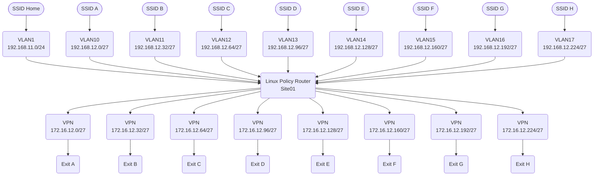
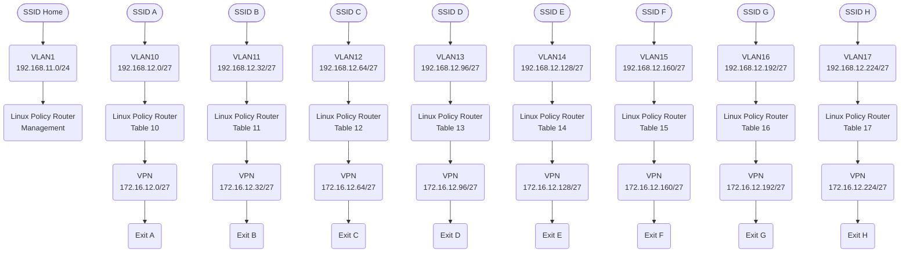
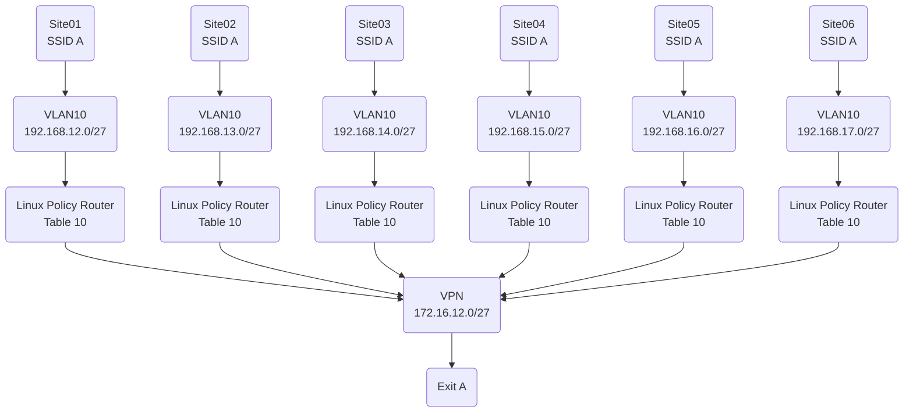
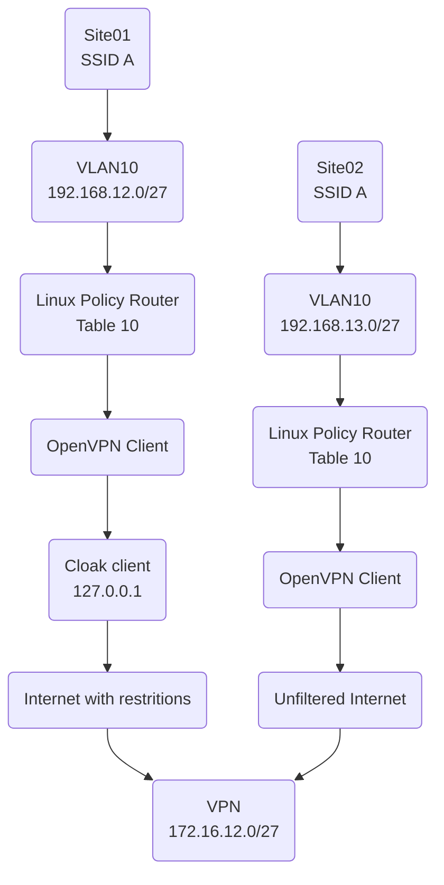
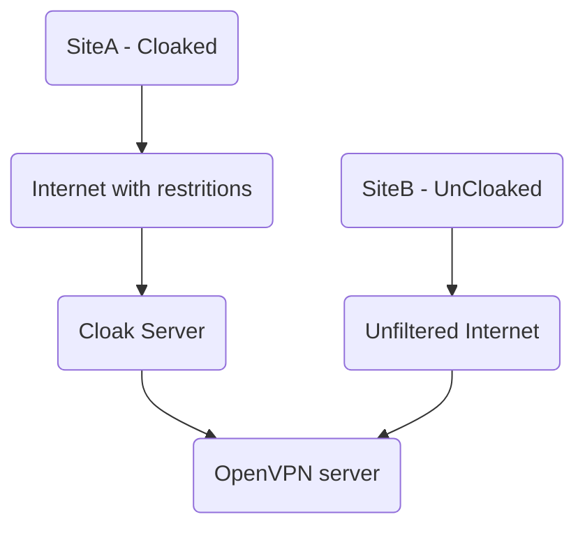

# linux-vpn-router
This is a linux route table example

This may also be considered policy routing.  It's sole purpose was as an experiment from what I was doing around 2000
The idea is multiple exit gateways.
A simple discription might be I want to watch different streaming services in different countries. So we get a VPS in each country, add openvpn and set an iptables rule.
Locally we have 802.1Q tagged vlans with a raspberry pi or similar acting as the router, finally some wifi access points with a SSID per country

* The [common](common) folder will contain elements which are common to both the gateways and the central policy router
* The [exits](exits) folder will contain the config for the remote gatewaysm exit nodes (only one example) some of this will be generic
* The [sites](sites) folder will contain the config for the linux box (raspberry pi) at the centre

## Topology

In terms of IP ranges I'm using RFC1918 IP's from the `172.16.0.0/12` and `192.168.0.0/16` ranges. As this is a small example `/27`'s with 32 IP's (generally considered 30 usable) is more than sufficent. A `/27` has a Netmask of `255.255.255.224`.  Vlan 1 is the management (native) vlan. For configuring things (eg via ssh) we will operate off vlan1. I know we can set any vlan as native (untagged).

Assuming multiple links the table might look as follows. Note that I'm trying to align the ranges to make the explination simple

|Branch|VPN Range|Client Range|Client VLAN|First IP|Last IP|
|-|-|-|-|-|-|
|0||192.168.11.0/24|1|1|254|
|A|172.16.12.0/27|192.168.12.0/27|10|1|30|
|B|172.16.12.32/27|192.168.12.32/27|11|33|62|
|C|172.16.12.64/27|192.168.12.64/27|12|65|94|
|D|172.16.12.96/27|192.168.12.96/27|13|97|126|
|E|172.16.12.128/27|192.168.12.128/27|14|129|158|
|F|172.16.12.160/27|192.168.12.160/27|15|161|190|
|G|172.16.12.192/27|192.168.12.192/27|16|193|222|
|H|172.16.12.224/27|192.168.12.224/27|17|225|254|

The details may look as follows

From a client routing persective this looks like the following

Each gateway is configured / assumed to have multiple such sites connecting. Note that this is NOT a site to site configuration.

Extending this to multiple sites we have
|Site|Range|
|-|-|
|01|192.168.12.0/24|
|02|192.168.13.0/24|
|03|192.168.14.0/24|
|04|192.168.15.0/24|
|05|192.168.16.0/24|
|06|192.168.17.0/24|

As an example

## Cloaking
Simple config for [cbeuw/Cloak](https://github.com/cbeuw/Cloak) has been added so VPN's are supported in locations which otherwise might be blocked.  Cloak masks openvpn traffic so it appears to be standard HTTPS traffic.

On the exit node side it is an additional process so regular OpenVPN traffic may be on one port with Cloak on a seperate port, AKA supporting both cloaked and regular vpn traffic.
On the site side the openvpn client sets to the remote openvpn server as the cloak server on localhost.

As an examples
* SiteA (Cloaking)
* SiteB (UnCloaked)

* ExitA with Cloaking Support

